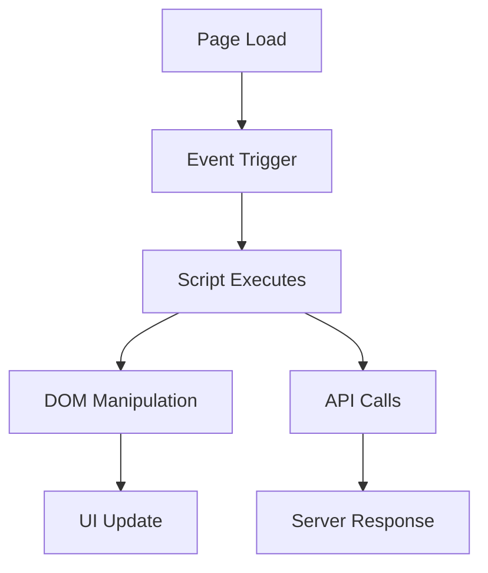

## Overview

Zohocorp provides a powerful platform for extending CRM functionality through client scripts, widgets, serverless functions, and seamless integrations. You gain flexibility to customize user interfaces, automate workflows, and connect with external services. These core concepts form the building blocks for creating scalable CRM solutions.

<Callout kind="info">
Master these foundations before diving into implementation details.
</Callout>

## Key Concepts

Explore the primary building blocks of Zohocorp.

<Columns cols={2}>
  <Card title="Client Scripts" icon="code" href="#client-scripts">
    JavaScript-based extensions that run in the browser to enhance record views and forms.
  </Card>

  <Card title="Widgets" icon="package" href="#widgets">
    Reusable UI components built with the CLI for embedding custom interfaces.
  </Card>

  <Card title="Serverless Functions" icon="server" href="#functions">
    Event-driven, scalable code execution without managing infrastructure.
  </Card>

  <Card title="Integrations" icon="link" href="#integrations">
    Patterns for connecting Zohocorp with third-party APIs and services.
  </Card>
</Columns>

## Client Script Architecture

Client scripts execute on the frontend, responding to events like form loads or field changes. They use a modular structure with events, commands, and static resources.



<CodeGroup tabs="JavaScript">
  ```javascript
  // Register event listener
  clientScript.on('record:view', async (event) => {
    const recordId = event.record.id;
    const data = await zoho.crm.getRecord('Leads', recordId);
    console.log(`Lead: ${data.First_Name}`);
  });
  ```
</CodeGroup>

<Callout kind="tip">
Use `{event}` objects to access context like `record.id` or `module.apiName`.
</Callout>

## Widgets as UI Extensions

Widgets extend the CRM interface with custom React-based components. Install the CLI, create a widget, and deploy it to specific modules.

<Steps>
  <Step title="Install CLI" icon="download">
    
    ```bash
    npm install -g @zohocorp/cli
    zohocli login
    ```
    
  </Step>

  <Step title="Create Widget" icon="plus">
    
    ```bash
    zohocli widget create my-widget
    cd my-widget
    npm start
    ```
    
  </Step>

  <Step title="Deploy" icon="upload">
    
    ```bash
    zohocli widget deploy
    ```
    
  </Step>
</Steps>

## Serverless Functions Workflow

Functions handle backend logic triggered by events like record creation. Write in JavaScript or Deluge, deploy, and invoke via API.

<Tabs>
  <Tab title="JavaScript" icon="code">
    
    ```javascript
    exports.handler = async (event) => {
      const payload = JSON.parse(event.body);
      // Process CRM record update
      await fetch('https://api.example.com/leads', {
        method: 'POST',
        body: JSON.stringify(payload)
      });
      return { status: 'success' };
    };
    ```
    
  </Tab>

  <Tab title="Deluge" icon="file">
    
    ```deluge
    lead = Leads.getRecordById(input.id);
    lead.set("Status", "Qualified");
    lead.save();
    ```
    
  </Tab>
</Tabs>

## Integration Patterns

Connect Zohocorp to external services using webhooks, OAuth, or direct API calls. Common patterns include real-time sync and batch processing.

<Expandable title="Webhook Setup" default-open="true">

Configure incoming webhooks at `https://api.example.com/webhooks`.

```javascript
// Handle incoming webhook
app.post('/webhook', (req, res) => {
  const crmData = req.body;
  // Upsert to Zohocorp CRM
  zoho.crm.upsertRecord('Contacts', crmData);
  res.status(200).send('OK');
});
```

</Expandable>

<Expandable title="OAuth Flow">

1. Redirect to `https://auth.example.com/oauth/authorize`
2. Exchange code for token
3. Use token in API calls

</Expandable>

<Columns cols={2}>
  <Card title="Quickstart" icon="rocket" href="/quickstart">
    Build your first customization.
  </Card>

  <Card title="Authentication" icon="lock" href="/authentication">
    Secure your integrations.
  </Card>
</Columns>